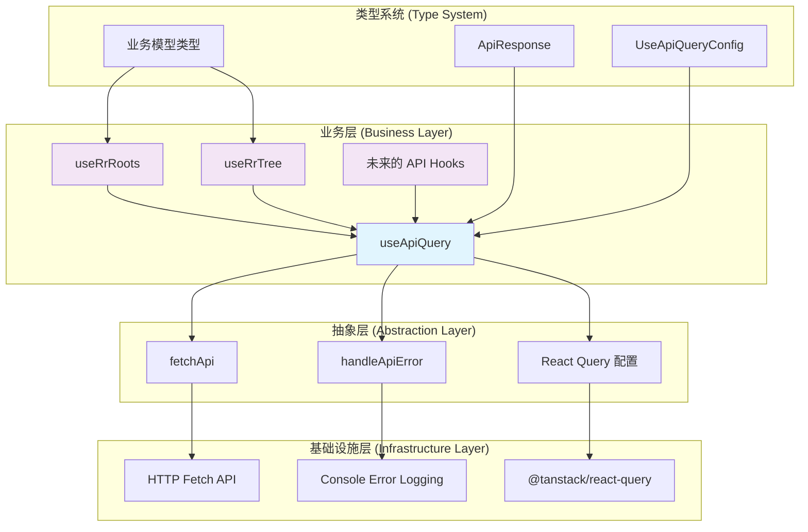

# API Service Layer 架构设计

## 架构概览



## 重构收益分析

### 🎯 代码复用率提升

- **重复代码消除**: 从 76 行重复代码减少到 0 行
- **维护成本降低**: 错误处理、重试逻辑、缓存策略统一管理
- **一致性保证**: 所有 API 调用遵循相同的最佳实践

### 🚀 性能优化内置

```typescript
// 生产环境验证的配置
staleTime: 5 * 60 * 1000,        // 5分钟缓存
retry: 3,                        // 智能重试
retryDelay: exponentialBackoff,  // 指数退避算法
```

### 🔧 类型安全增强

```typescript
// 强类型约束，编译时错误检测
useApiQuery<RrRoot[], RrRoot[]>({
  endpoint: "/rr-root",
  select: (response) => response.data || [],
});
```

### 📈 可扩展性设计

- **新增 API**: 只需调用 `useApiQuery`，无需重复实现
- **配置覆盖**: 支持自定义 Query 选项
- **条件查询**: 内置 `enabled` 参数支持

## 使用示例

### 基础用法

```typescript
const { data, isLoading, error } = useApiQuery<User[], User[]>({
  endpoint: "/users",
  queryKey: ["users"],
  select: (response) => response.data || [],
});
```

### 带参数查询

```typescript
const { data: user } = useApiQuery<User, User | null>({
  endpoint: `/users/${userId}`,
  queryKey: ["user", userId],
  select: (response) => response.data || null,
  enabled: !!userId,
});
```

### 自定义配置

```typescript
const { data } = useApiQuery<Post[]>({
  endpoint: "/posts",
  queryKey: ["posts"],
  options: {
    staleTime: 10 * 60 * 1000, // 覆盖默认缓存时间
    refetchOnWindowFocus: false,
  },
});
```

## 架构原则

1. **单一职责**: 每个函数只负责一个明确的功能
2. **开闭原则**: 对扩展开放，对修改封闭
3. **依赖倒置**: 业务层依赖抽象，而非具体实现
4. **类型优先**: TypeScript 类型系统确保编译时安全
5. **性能导向**: 内置生产环境验证的最佳实践

## 未来扩展方向

- **缓存策略**: 支持更细粒度的缓存控制
- **离线支持**: 集成 Service Worker 缓存
- **实时更新**: WebSocket 集成支持
- **错误边界**: 更智能的错误恢复机制
