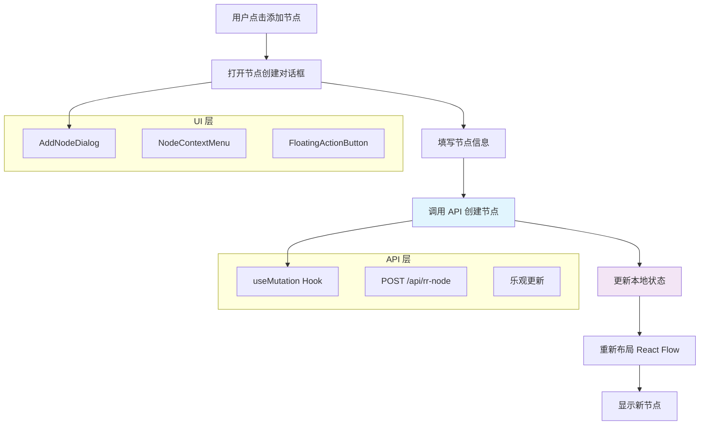

# React Flow 节点添加功能实现指南

## 📋 概述

本文档详细介绍如何在 React Flow 思维导图项目中实现动态添加节点的功能。该方案遵循现代前端架构最佳实践，确保类型安全和优秀的用户体验。

## 🎯 核心架构设计



## 🚀 实现步骤

### 步骤 1: 创建 API Mutation Hook

创建文件 `apps/web/lib/service/rrNodeApi.ts`：

```typescript
import { useMutation, useQueryClient } from "@tanstack/react-query";
import { CreateNodeRequest } from "../types/apiRequests";
import { RrNode } from "../types/models";

const API_BASE_URL =
  process.env.NEXT_PUBLIC_API_URL || "http://localhost:3001/api";

/**
 * 创建新节点的 Mutation Hook
 * 使用乐观更新策略提升用户体验
 */
export const useCreateNode = () => {
  const queryClient = useQueryClient();

  return useMutation({
    mutationFn: async (request: CreateNodeRequest): Promise<RrNode> => {
      const response = await fetch(`${API_BASE_URL}/rr-node`, {
        method: "POST",
        headers: { "Content-Type": "application/json" },
        body: JSON.stringify(request),
      });

      if (!response.ok) {
        throw new Error(`Failed to create node: ${response.statusText}`);
      }

      const result = await response.json();
      return result.data;
    },
    onSuccess: (newNode, variables) => {
      // 乐观更新：立即刷新相关的树数据
      queryClient.invalidateQueries({
        queryKey: ["rr-tree", variables.parentId.toString()],
      });
    },
    onError: (error) => {
      console.error("创建节点失败:", error);
      // 这里可以添加 toast 通知
    },
  });
};
```

### 步骤 2: 创建节点添加对话框组件

创建文件 `apps/web/components/flow/add-node-dialog.tsx`：

```typescript
import { useState } from "react";
import { Dialog, DialogContent, DialogHeader, DialogTitle } from "@/components/ui/dialog";
import { Button } from "@/components/ui/button";
import { Input } from "@/components/ui/input";
import { Textarea } from "@/components/ui/textarea";
import { Label } from "@/components/ui/label";
import { useCreateNode } from "@/lib/service/rrNodeApi";
import { ObjectId } from "@/lib/types/common";
import { Loader2 } from "lucide-react";

interface AddNodeDialogProps {
  open: boolean;
  onOpenChange: (open: boolean) => void;
  parentId: ObjectId;
  parentTitle: string;
}

/**
 * 添加节点对话框组件
 * 提供用户友好的节点创建界面
 */
export function AddNodeDialog({
  open,
  onOpenChange,
  parentId,
  parentTitle
}: AddNodeDialogProps) {
  const [title, setTitle] = useState("");
  const [description, setDescription] = useState("");
  const createNodeMutation = useCreateNode();

  const handleSubmit = async (e: React.FormEvent) => {
    e.preventDefault();
    if (!title.trim()) return;

    try {
      await createNodeMutation.mutateAsync({
        title: title.trim(),
        description: description.trim() || undefined,
        parentId,
      });

      // 重置表单并关闭对话框
      setTitle("");
      setDescription("");
      onOpenChange(false);
    } catch (error) {
      // 错误处理已在 mutation 中完成
    }
  };

  const handleCancel = () => {
    setTitle("");
    setDescription("");
    onOpenChange(false);
  };

  return (
    <Dialog open={open} onOpenChange={onOpenChange}>
      <DialogContent className="sm:max-w-[425px]">
        <DialogHeader>
          <DialogTitle>添加子节点</DialogTitle>
          <p className="text-sm text-muted-foreground">
            为 "{parentTitle}" 添加一个新的子节点
          </p>
        </DialogHeader>

        <form onSubmit={handleSubmit} className="space-y-4">
          <div className="space-y-2">
            <Label htmlFor="title">节点标题 *</Label>
            <Input
              id="title"
              value={title}
              onChange={(e) => setTitle(e.target.value)}
              placeholder="输入节点标题"
              autoFocus
              disabled={createNodeMutation.isPending}
            />
          </div>

          <div className="space-y-2">
            <Label htmlFor="description">节点描述</Label>
            <Textarea
              id="description"
              value={description}
              onChange={(e) => setDescription(e.target.value)}
              placeholder="输入节点描述（可选）"
              rows={3}
              disabled={createNodeMutation.isPending}
            />
          </div>

          <div className="flex justify-end space-x-2">
            <Button
              type="button"
              variant="outline"
              onClick={handleCancel}
              disabled={createNodeMutation.isPending}
            >
              取消
            </Button>
            <Button
              type="submit"
              disabled={!title.trim() || createNodeMutation.isPending}
            >
              {createNodeMutation.isPending && (
                <Loader2 className="mr-2 h-4 w-4 animate-spin" />
              )}
              {createNodeMutation.isPending ? "创建中..." : "创建节点"}
            </Button>
          </div>
        </form>
      </DialogContent>
    </Dialog>
  );
}
```

### 步骤 3: 增强节点组件的交互能力

修改 `apps/web/components/flow/rr-node.tsx`：

```typescript
import React, { useState } from "react";
import { Handle, Position, type NodeProps } from "@xyflow/react";
import { RrNode } from "@/lib/types/models";
import {
  Card,
  CardContent,
  CardDescription,
  CardHeader,
  CardTitle,
} from "@/components/ui/card";
import { Button } from "@/components/ui/button";
import { Plus } from "lucide-react";
import { AddNodeDialog } from "./add-node-dialog";

/**
 * 自定义 RrNode 组件
 * 用于在 React Flow 中渲染思维导图节点
 * 支持动态添加子节点功能
 */
const RrNodeComponent: React.FC<NodeProps> = ({ data, selected }) => {
  const [showAddDialog, setShowAddDialog] = useState(false);
  const { rrNode } = data as {
    label: string;
    rrNode: RrNode;
  };

  // 判断是否为根节点（没有 parentId）
  const isRootNode = !rrNode.parentId;

  const handleAddNode = (e: React.MouseEvent) => {
    e.stopPropagation();
    setShowAddDialog(true);
  };

  return (
    <>
      <Card
        className={`
          rr-node
          min-w-[250px] max-w-[300px]
          transition-all duration-200
          ${selected ? "ring-2 ring-primary shadow-lg" : ""}
          hover:shadow-lg
          group
        `}
      >
        {/* 输入连接点 */}
        {!isRootNode && (
          <Handle
            type="target"
            position={Position.Top}
            className="w-3 h-3 bg-primary border-2 border-background"
          />
        )}

        <CardHeader className="pb-2">
          <div className="flex items-start justify-between gap-2">
            <CardTitle
              className={`
                text-sm leading-tight flex-1
                ${isRootNode ? "text-primary" : "text-foreground"}
              `}
            >
              {rrNode.title}
            </CardTitle>

            {/* 添加子节点按钮 */}
            <Button
              size="sm"
              variant="ghost"
              className="
                opacity-0 group-hover:opacity-100
                transition-opacity duration-200
                h-6 w-6 p-0
                hover:bg-primary/10
              "
              onClick={handleAddNode}
              title="添加子节点"
            >
              <Plus className="h-3 w-3" />
            </Button>
          </div>

          {rrNode.description && (
            <CardDescription className="text-xs leading-relaxed">
              {rrNode.description}
            </CardDescription>
          )}
        </CardHeader>

        <CardContent className="pt-0">
          <div className="flex items-center justify-between">
            <span
              className={`
                text-xs px-2 py-1 rounded-full
                ${isRootNode ? "bg-primary/10 text-primary" : "bg-muted text-muted-foreground"}
              `}
            >
              {isRootNode ? "根节点" : "子节点"}
            </span>

            {rrNode.children && rrNode.children.length > 0 && (
              <span className="text-xs text-muted-foreground">
                {rrNode.children.length} 子节点
              </span>
            )}
          </div>
        </CardContent>

        {/* 输出连接点 */}
        {rrNode.children && rrNode.children.length > 0 && (
          <Handle
            type="source"
            position={Position.Bottom}
            className="w-3 h-3 bg-accent border-2 border-background"
          />
        )}
      </Card>

      {/* 添加节点对话框 */}
      <AddNodeDialog
        open={showAddDialog}
        onOpenChange={setShowAddDialog}
        parentId={rrNode._id}
        parentTitle={rrNode.title}
      />
    </>
  );
};

export default RrNodeComponent;
```

### 步骤 4: 后端 API 端点实现

#### 4.1 创建 DTO

创建文件 `apps/api/src/dto/create-node.dto.ts`：

```typescript
import { IsString, IsOptional, IsNotEmpty } from "class-validator";
import { Types } from "mongoose";

export class CreateNodeDto {
  @IsString()
  @IsNotEmpty()
  title!: string;

  @IsString()
  @IsOptional()
  description?: string;

  @IsNotEmpty()
  parentId!: Types.ObjectId;
}
```

#### 4.2 创建控制器

创建文件 `apps/api/src/rr-node/rr-node.controller.ts`：

```typescript
import {
  Controller,
  Post,
  Body,
  HttpException,
  HttpStatus,
} from "@nestjs/common";
import { RrNodeService } from "./rr-node.service";
import { CreateNodeDto } from "../dto/create-node.dto";

@Controller("rr-node")
export class RrNodeController {
  constructor(private readonly rrNodeService: RrNodeService) {}

  @Post()
  async create(@Body() createNodeDto: CreateNodeDto) {
    try {
      const newNode = await this.rrNodeService.create(createNodeDto);
      return newNode;
    } catch (error) {
      throw new HttpException(
        {
          code: "CREATE_NODE_FAILED",
          message: "创建节点失败",
          details: error instanceof Error ? error.message : error,
        },
        HttpStatus.INTERNAL_SERVER_ERROR,
      );
    }
  }
}
```

#### 4.3 创建服务

创建文件 `apps/api/src/rr-node/rr-node.service.ts`：

```typescript
import { Injectable } from "@nestjs/common";
import { InjectModel } from "@nestjs/mongoose";
import { Model, Types } from "mongoose";
import { RrNode } from "../schemas/rr-node.schema";
import { RrTree } from "../schemas/rr-tree.schema";
import { CreateNodeDto } from "../dto/create-node.dto";

@Injectable()
export class RrNodeService {
  constructor(
    @InjectModel(RrNode.name) private rrNodeModel: Model<RrNode>,
    @InjectModel(RrTree.name) private rrTreeModel: Model<RrTree>,
  ) {}

  async create(createNodeDto: CreateNodeDto): Promise<RrNode> {
    // 创建新节点
    const newNode = new this.rrNodeModel({
      title: createNodeDto.title,
      description: createNodeDto.description,
      parentId: createNodeDto.parentId,
      children: null,
    });

    const savedNode = await newNode.save();

    // 更新父节点的 children 数组
    await this.updateParentChildren(createNodeDto.parentId, savedNode);

    // 更新对应的 RrTree 文档
    await this.updateTreeStructure(createNodeDto.parentId);

    return savedNode;
  }

  private async updateParentChildren(
    parentId: Types.ObjectId,
    newNode: RrNode,
  ) {
    // 这里需要实现更新父节点 children 数组的逻辑
    // 由于使用的是嵌套文档结构，需要递归更新
  }

  private async updateTreeStructure(parentId: Types.ObjectId) {
    // 重新构建树结构并更新 RrTree 文档
    // 这里需要实现树结构重建逻辑
  }
}
```

## 🎨 用户体验优化

### 交互设计

1. **悬停显示**: 只有在鼠标悬停时才显示添加按钮，保持界面简洁
2. **视觉反馈**: 按钮有平滑的透明度过渡动画
3. **加载状态**: 创建过程中显示加载指示器
4. **错误处理**: 完善的错误提示和恢复机制

### 性能优化

1. **乐观更新**: 使用 React Query 的缓存失效机制
2. **防抖处理**: 避免重复提交
3. **内存管理**: 及时清理事件监听器

## 📱 使用方式

用户可以通过以下步骤添加新节点：

1. **悬停节点**: 将鼠标悬停在任意节点上
2. **点击添加**: 点击出现的 "+" 按钮
3. **填写信息**: 在对话框中输入节点标题和描述
4. **确认创建**: 点击"创建节点"按钮
5. **查看结果**: 新节点立即出现在思维导图中

## 🔧 技术栈

- **前端框架**: Next.js 14 + React 18
- **状态管理**: React Query (TanStack Query)
- **UI 组件**: shadcn/ui + Tailwind CSS
- **图形渲染**: React Flow (@xyflow/react)
- **后端框架**: NestJS + MongoDB
- **类型安全**: TypeScript

## 🚨 注意事项

1. **数据一致性**: 确保前后端数据结构保持同步
2. **错误边界**: 实现完善的错误处理机制
3. **权限控制**: 根据需要添加用户权限验证
4. **性能监控**: 监控大型树结构的渲染性能

## 🔮 未来扩展

- **拖拽重排**: 支持拖拽改变节点层级关系
- **批量操作**: 支持多选和批量添加/删除
- **模板系统**: 预定义节点模板快速创建
- **协作功能**: 实时多人协作编辑
- **版本控制**: 节点变更历史记录

---

**💡 提示**: 这个实现方案将静态的思维导图转换为动态的、可交互的知识管理工具，同时保持了代码的可维护性和扩展性。遵循了现代 Web 开发的最佳实践，包括类型安全、性能优化和用户体验设计。
