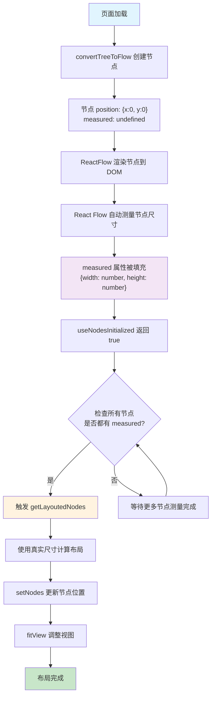
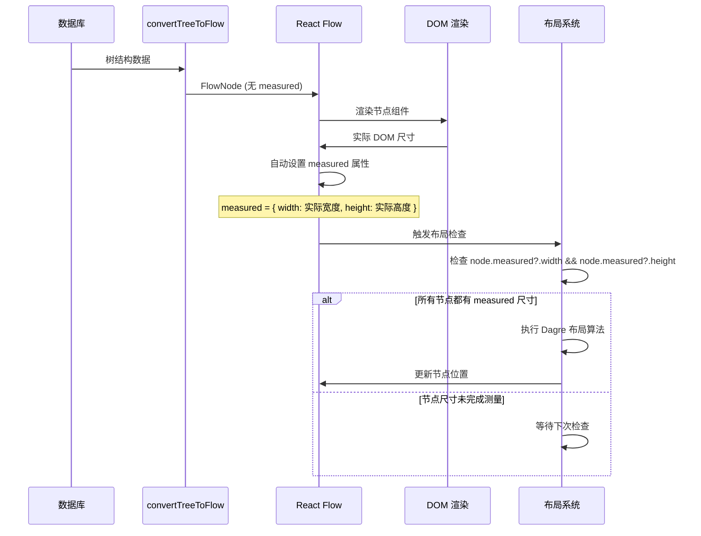

# React Flow Node Measured 属性生命周期

## 问题描述

在 React Flow 中，节点初始创建时位置为 `(0,0)`，`measured` 属性为 `undefined`。只有当节点渲染到 DOM 后，React Flow 才会自动测量并填充 `measured` 属性（包含 `width` 和 `height`）。我们需要检测这个变化并在测量完成后触发重新布局。

## 解决方案

使用 `useNodesInitialized` 钩子配合 `measured` 属性检测来实现自动布局触发。

## 工作流程



## 关键技术点

### 1. useNodesInitialized 钩子

```typescript
const nodesInitialized = useNodesInitialized();
```

- 当所有节点都完成初始化（包括 DOM 渲染和尺寸测量）时返回 `true`
- 这是检测节点准备就绪的最佳方式

### 2. 简化的检测逻辑

```typescript
if (nodesInitialized && !hasTriggeredLayout.current && nodes.length > 0) {
  // useNodesInitialized 返回 true 就保证所有节点都有 measured 属性
  const currentNodes = getNodes();
  const { newNodes } = getLayoutedNodes(currentNodes, edges, "TB");
  setNodes(newNodes);
}
```

- `useNodesInitialized` 返回 `true` 就保证所有节点都已完成测量
- 无需额外检查 `measured` 属性，避免过度设计

### 3. 防重复触发机制

```typescript
const hasTriggeredLayout = useRef(false);
```

- 使用 `useRef` 标记是否已触发布局
- 避免在节点更新过程中重复计算布局

### 4. 布局算法集成

```typescript
const { newNodes } = getLayoutedNodes(currentNodes, edges, "TB");
setNodes(newNodes);
```

- 使用 Dagre 算法基于真实的节点尺寸计算最优布局
- 直接更新节点位置，无需重新创建

## 优势

1. **自动化**: 无需手动触发布局，系统自动检测并响应
2. **准确性**: 基于真实的 DOM 渲染尺寸进行布局计算
3. **性能**: 只在必要时触发一次布局计算
4. **用户体验**: 平滑的动画过渡和自动视图适配

## 实现细节

参见 `/apps/web/components/flow/flow-content.tsx` 中的 `FlowContentInner` 组件实现。


