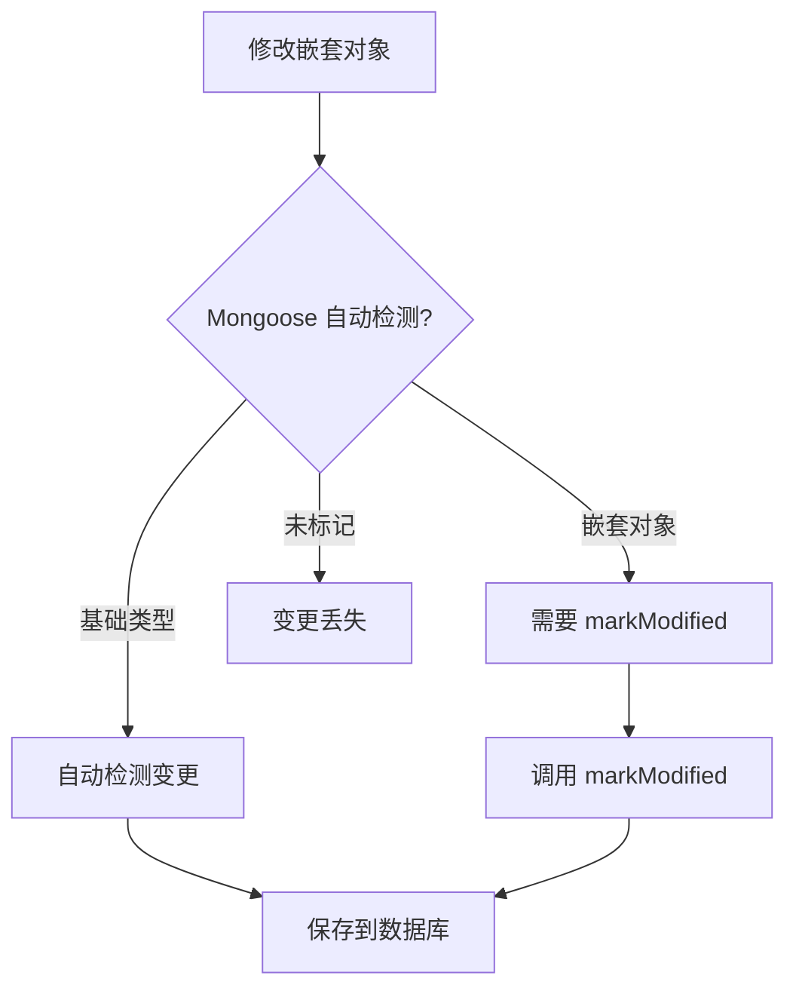
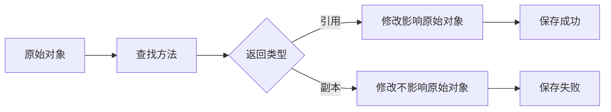

# Mongoose 嵌套对象保存问题深度分析

## 问题概述

在开发树形结构数据的节点添加功能时，遇到了一个典型的 Mongoose 嵌套对象保存问题：前端显示添加成功，后端无报错，但数据库中没有新增数据。

## 问题现象

- ✅ 前端显示操作成功
- ✅ 后端 API 返回 200 状态码
- ✅ 数据库 `updatedAt` 字段正常更新
- ❌ 新添加的节点未保存到数据库

## 技术背景

### 数据结构设计

```typescript
// RrTree Schema - 树结构
@Schema({ timestamps: true, collection: "rr_trees" })
export class RrTree {
  @Prop({ type: Types.ObjectId, ref: "RrRoot", unique: true })
  rootId!: Types.ObjectId;

  @Prop({ type: RrNode, required: true })
  rootNode!: RrNode; // 嵌套的根节点
}

// RrNode Schema - 节点结构（递归）
@Schema()
export class RrNode {
  @Prop({ type: Types.ObjectId, auto: true })
  _id!: Types.ObjectId;

  @Prop({ required: true, type: String })
  title!: string;

  @Prop({ type: Types.ObjectId, default: null })
  parentId!: Types.ObjectId | null;

  @Prop({ type: [{ type: Object }], default: null })
  children!: RrNode[] | null; // 递归嵌套子节点
}
```

## 失败原因分析

### 1. 查询与更新方法不一致

**错误代码：**

```typescript
// rr-tree.service.ts - 原始错误版本
async findOne(id: string): Promise<RrTree> {
  return await this.rrTreeModel.findOne({ rootId: new Types.ObjectId(id) }); // 通过 rootId 查询
}

async save(treeRootId: string, tree: RrTree): Promise<RrTree | null> {
  return await this.rrTreeModel.findByIdAndUpdate(
    treeRootId, // 错误：期望文档 _id，但传入的是 rootId
    { rootNode: tree.rootNode },
    { new: true }
  );
}
```

**问题分析：**

- `findOne` 方法通过 `rootId` 字段查询
- `save` 方法使用 `findByIdAndUpdate` 期望文档的 `_id`
- 传入的 `treeRootId` 实际是 `rootId` 值，不是文档 `_id`
- 导致更新操作找不到目标文档

### 2. 递归 Schema 定义错误

**错误代码：**

```typescript
@Prop({ type: [Object], default: null }) // 错误：使用通用 Object 类型
children!: RrNode[] | null;
```

**问题分析：**

- 使用 `[Object]` 无法正确处理递归结构
- Mongoose 无法识别嵌套对象的具体类型
- 导致序列化和反序列化问题

### 3. 嵌套对象变更检测失效

**错误代码：**

```typescript
const result = await this.rrTreeModel.findOneAndUpdate(
  { rootId: new Types.ObjectId(treeRootId) },
  { rootNode: tree.rootNode }, // 直接替换，无法检测深层变更
  { new: true },
);
```

**问题分析：**

- `findOneAndUpdate` 直接替换字段值
- 对于嵌套对象的深层变更，Mongoose 无法自动检测
- 需要显式调用 `markModified()` 标记变更

### 4. 对象引用不一致（核心问题）

**错误代码：**

```typescript
// 查找父节点（返回副本）
const parentNode = this.findNode(parentId, tree.rootNode);

// 在副本上添加节点
parentNode.children.push(newNode);

// 保存原始树结构（副本的修改丢失）
const savedTree = await this.rrTreeService.save(tree.rootId.toString(), tree);
```

**调试日志证据：**

```
添加节点前 children 长度: 0
添加节点后 children 长度: 1  // 在副本上成功添加
保存前 document.rootNode children 长度: 4
传入的 tree.rootNode children 长度: 4  // 原始结构未变
```

**问题分析：**

- `findNode` 方法返回的是对象副本，不是原始引用
- 在副本上的修改无法反映到原始数据结构
- 保存时使用的是未修改的原始结构

### 5. 异常处理缺陷

**错误代码：**

```typescript
catch (error) {
  this.errorHandlerService.handleDatabaseError(error, 'save_tree');
  // 缺少 throw error; 导致静默失败
}
```

## 成功修复方案

### 1. 统一查询和更新逻辑

```typescript
async save(treeRootId: string, tree: RrTree): Promise<RrTree | null> {
  try {
    // 先查找文档
    const document = await this.rrTreeModel.findOne({
      rootId: new Types.ObjectId(treeRootId)
    });

    if (!document) {
      this.errorHandlerService.throwNotFound('树结构', treeRootId);
    }

    // 更新 rootNode
    document.rootNode = tree.rootNode;

    // 标记嵌套对象已修改
    document.markModified('rootNode');

    // 保存文档
    const result = await document.save();

    return result;
  } catch (error) {
    this.errorHandlerService.handleDatabaseError(error, 'save_tree');
    throw error; // 重新抛出异常
  }
}
```

### 2. 正确的递归 Schema 定义

```typescript
@Schema()
export class RrNode {
  // ... 其他字段

  @Prop({ type: [{ type: Object }], default: null })
  children!: RrNode[] | null;
}

export const RrNodeSchema = SchemaFactory.createForClass(RrNode);

// 设置递归引用
RrNodeSchema.add({
  children: [RrNodeSchema],
});
```

### 3. 直接在原始对象上操作

```typescript
private addNodeToTree(rootNode: RrNode, parentId: Types.ObjectId, newNode: RrNode): boolean {
  // 检查是否为目标父节点
  if (parentId.equals(rootNode._id)) {
    if (rootNode.children === null) {
      rootNode.children = [];
    }
    rootNode.children.push(newNode); // 直接在原始对象上操作
    return true;
  }

  // 递归查找
  if (!rootNode.children?.length) {
    return false;
  }

  for (const child of rootNode.children) {
    if (this.addNodeToTree(child, parentId, newNode)) {
      return true;
    }
  }

  return false;
}

// 使用方式
const success = this.addNodeToTree(tree.rootNode, parentId, newNode);
if (!success) {
  this.errorHandlerService.throwNotFound('父节点', parentId);
}
```

## 核心技术原理

### Mongoose 变更检测机制



### JavaScript 对象引用机制



## 企业级最佳实践

### 1. 查询一致性原则

```typescript
// ✅ 好的做法：查询和更新使用相同字段
class TreeService {
  async findByRootId(rootId: string) {
    return await this.model.findOne({ rootId: new Types.ObjectId(rootId) });
  }

  async updateByRootId(rootId: string, data: any) {
    const doc = await this.findByRootId(rootId);
    // 更新逻辑
  }
}
```

### 2. 嵌套对象修改模式

```typescript
// ✅ 推荐：查找 + 修改 + markModified + 保存
async updateNestedObject(id: string, updates: any) {
  const document = await this.model.findById(id);

  // 修改嵌套对象
  document.nestedField = updates;

  // 标记变更
  document.markModified('nestedField');

  // 保存
  return await document.save();
}
```

### 3. 递归结构操作模式

```typescript
// ✅ 推荐：直接在原始结构上操作
class TreeOperations {
  private modifyInPlace(
    root: TreeNode,
    targetId: string,
    operation: Function,
  ): boolean {
    if (root.id === targetId) {
      operation(root); // 直接修改原始对象
      return true;
    }

    for (const child of root.children || []) {
      if (this.modifyInPlace(child, targetId, operation)) {
        return true;
      }
    }

    return false;
  }
}
```

### 4. 错误处理最佳实践

```typescript
// ✅ 完整的错误处理
async saveData(data: any) {
  try {
    const result = await this.performOperation(data);
    return result;
  } catch (error) {
    // 记录错误
    this.logger.error('Save operation failed', error);

    // 处理特定错误
    this.errorHandler.handle(error);

    // 重新抛出，确保调用方知道失败
    throw error;
  }
}
```

## 调试策略

### 1. 对象引用追踪

```typescript
// 添加引用标识符进行追踪
const objectId = Math.random().toString(36);
console.log(`Object ${objectId} before:`, obj.children?.length);
// 执行操作
console.log(`Object ${objectId} after:`, obj.children?.length);
```

### 2. 数据流验证

```typescript
// 在关键节点验证数据状态
const validateDataFlow = (stage: string, data: any) => {
  console.log(
    `[${stage}] Children count:`,
    data.rootNode.children?.length || 0,
  );
};
```

### 3. Mongoose 调试

```typescript
// 启用 Mongoose 调试模式
mongoose.set("debug", true);

// 监听变更事件
document.on("save", () => console.log("Document saved"));
document.on("validate", () => console.log("Document validated"));
```

## 总结

这次问题的核心在于 **JavaScript 对象引用机制** 和 **Mongoose 嵌套对象变更检测** 的深层理解。关键教训：

1. **引用一致性**：确保修改操作作用于同一对象引用
2. **变更标记**：嵌套对象修改后必须调用 `markModified()`
3. **Schema 正确性**：递归结构需要正确的类型定义
4. **错误处理**：异常必须正确传播，避免静默失败
5. **调试策略**：通过数据流追踪定位引用问题

这些原则不仅适用于 Mongoose，也是所有涉及复杂数据结构操作的通用最佳实践。
