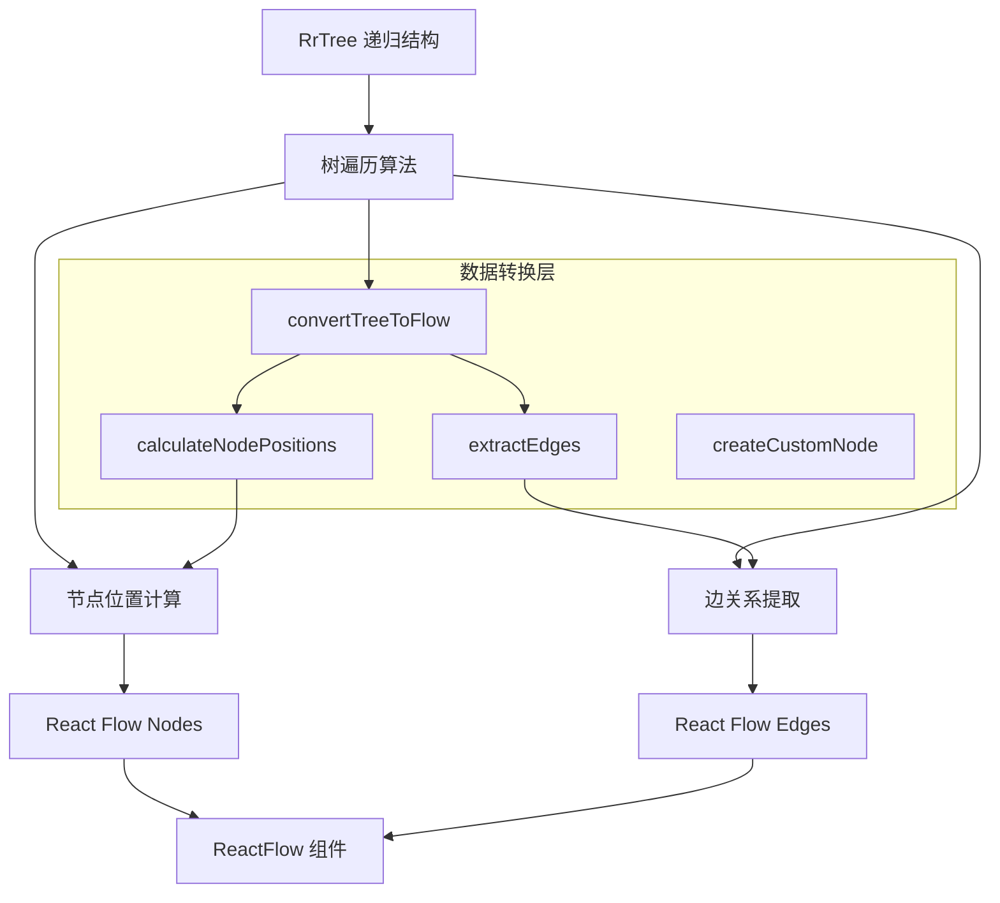
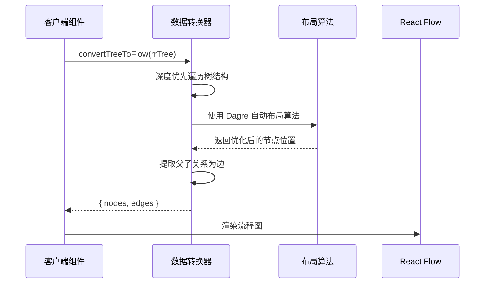
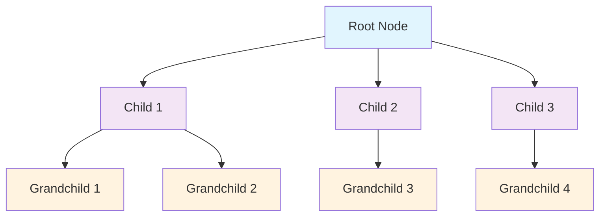
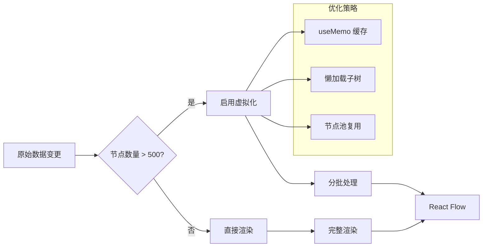
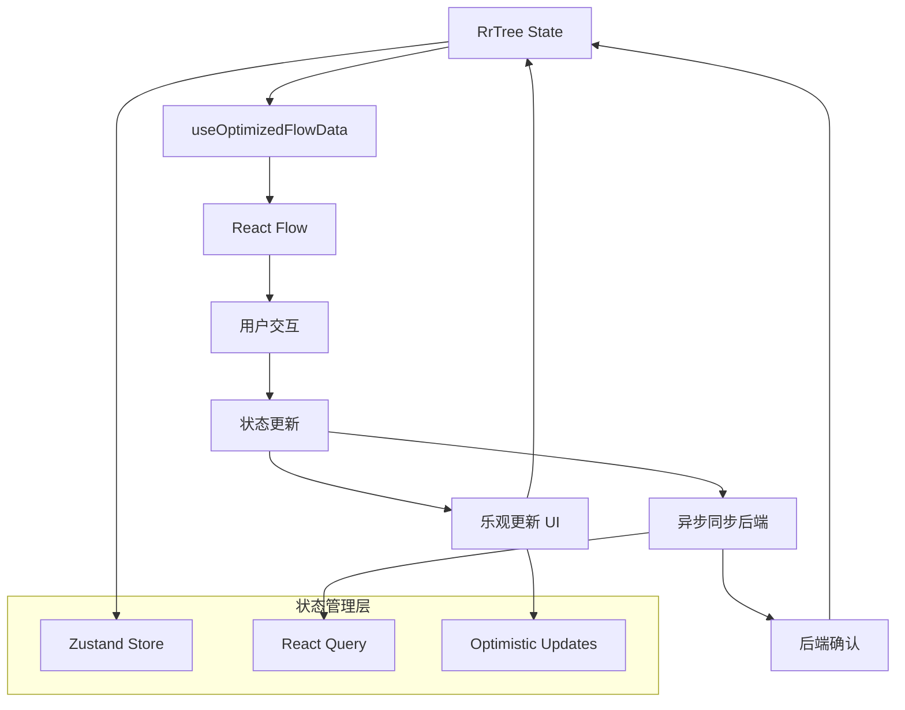

# React Flow 树形数据渲染方案

## 项目概述

本方案旨在将递归树结构的 `RrNode` 数据转换为 React Flow 可渲染的扁平化格式，实现思维导图的可视化展示。

## 核心挑战分析

### 数据结构差异

**原始数据结构 (RrNode)**:

```typescript
interface RrNode {
  _id: ObjectId;
  title: string;
  description?: string;
  parentId: ObjectId | null;
  children: RrNode[] | null;
  createdAt?: Date;
  updatedAt?: Date;
}
```

**React Flow 要求格式**:

- **Nodes**: 扁平数组，每个节点包含 `id`, `position`, `data`, `type` 等属性
- **Edges**: 扁平数组，每个连线包含 `id`, `source`, `target` 等属性

## 数据转换架构设计



## 技术方案详解

### 1. 核心类型定义

```typescript
// React Flow 节点类型
interface FlowNode {
  id: string;
  type: "rrNode";
  position: { x: number; y: number };
  data: {
    rrNode: RrNode;
  };
}

// React Flow 边类型
interface FlowEdge {
  id: string;
  source: string;
  target: string;
  type: "smoothstep" | "straight" | "step";
}

// 转换结果类型
interface FlowData {
  nodes: FlowNode[];
  edges: FlowEdge[];
}
```

### 2. 数据转换流程



### 3. 核心转换函数设计

```typescript
/**
 * 将 RrTree 转换为 React Flow 数据格式
 */
function convertTreeToFlow(rrTree: RrTree): FlowData {
  const nodes: FlowNode[] = [];
  const edges: FlowEdge[] = [];

  // 深度优先遍历，收集所有节点
  function traverseNode(node: RrNode, parentId?: string) {
    const nodeId = node._id.toString();

    // 创建 Flow 节点
    const flowNode: FlowNode = {
      id: nodeId,
      type: "rrNode",
      position: { x: 0, y: 0 }, // 由 Dagre 布局算法计算
      data: {
        rrNode: node,
      },
    };

    nodes.push(flowNode);

    // 创建父子连线
    if (parentId) {
      const edge: FlowEdge = {
        id: `${parentId}-${nodeId}`,
        source: parentId,
        target: nodeId,
        type: "smoothstep",
      };
      edges.push(edge);
    }

    // 递归处理子节点
    if (node.children) {
      node.children.forEach((child) => {
        traverseNode(child, nodeId);
      });
    }
  }

  // 从根节点开始遍历
  traverseNode(rrTree.rootNode);

  return {
    nodes,
    edges,
  };
}
```

### 4. 布局算法策略

#### Dagre 自动布局 (Dagre Auto Layout)

使用 Dagre 算法进行自动布局，无需手动计算节点位置：

```typescript
import dagre from 'dagre';

/**
 * 使用 Dagre 算法计算节点位置
 */
function getLayoutedNodes(nodes: FlowNode[], edges: FlowEdge[], direction = 'TB') {
  const dagreGraph = new dagre.graphlib.Graph();
  dagreGraph.setDefaultEdgeLabel(() => ({}));
  dagreGraph.setGraph({ rankdir: direction });

  nodes.forEach((node) => {
    dagreGraph.setNode(node.id, {
      width: node.measured?.width ?? 200,
      height: node.measured?.height ?? 100,
    });
  });

  edges.forEach((edge) => {
    dagreGraph.setEdge(edge.source, edge.target);
  });

  dagre.layout(dagreGraph);

  const newNodes = nodes.map((node) => {
    const nodeWithPosition = dagreGraph.node(node.id);
    return {
      ...node,
      position: {
        x: nodeWithPosition.x - (node.measured?.width ?? 200) / 2,
        y: nodeWithPosition.y - (node.measured?.height ?? 100) / 2,
      },
    };
  });

  return { newNodes, newEdges: edges };
}
```

#### 布局可视化



> **注意**: 使用 Dagre 算法后，节点位置由算法自动计算，无需手动指定层级坐标。

### 5. 自定义节点组件设计

```typescript
/**
 * 自定义 RrNode 组件
 */
const RrNodeComponent: React.FC<NodeProps> = ({ data, selected }) => {
  const { rrNode } = data;
  const isRootNode = !rrNode.parentId;

  return (
    <div className={`rr-node ${isRootNode ? 'root-node' : 'child-node'} ${selected ? 'selected' : ''}`}>
      <div className="node-header">
        <h3>{rrNode.title}</h3>
      </div>

      {rrNode.description && (
        <div className="node-description">
          {rrNode.description}
        </div>
      )}

      {/* React Flow Handles */}
      {!isRootNode && <Handle type="target" position={Position.Top} />}
      {rrNode.children && rrNode.children.length > 0 && (
        <Handle type="source" position={Position.Bottom} />
      )}
    </div>
  );
};

// 注册自定义节点类型
const nodeTypes = {
  rrNode: RrNodeComponent
};
```

### 6. 性能优化策略

#### 大数据集处理流程



#### 优化实现

```typescript
/**
 * 性能优化的转换 Hook
 */
function useFlowData(rrTree: RrTree) {
  const flowData = useMemo(() => {
    return convertTreeToFlow(rrTree);
  }, [rrTree]);

  return flowData;
}
```

### 7. 状态管理架构

#### 数据流设计



### 8. 组件集成示例

```typescript
/**
 * 主要的 Flow 组件
 */
const RrTreeFlow: React.FC<{ rrTree: RrTree }> = ({ rrTree }) => {
  const flowData = useFlowData(rrTree);
  const [nodes, setNodes, onNodesChange] = useNodesState(flowData.nodes);
  const [edges, setEdges, onEdgesChange] = useEdgesState(flowData.edges);

  const onConnect = useCallback(
    (params: Connection) => setEdges((eds) => addEdge(params, eds)),
    [setEdges]
  );

  return (
    <div className="rr-tree-flow">
      <ReactFlow
        nodes={nodes}
        edges={edges}
        onNodesChange={onNodesChange}
        onEdgesChange={onEdgesChange}
        onConnect={onConnect}
        nodeTypes={nodeTypes}
        fitView
      >
         <Background />
         <Controls />
         <MiniMap />
       </ReactFlow>
     </div>
   );
 };
```

## 实现优先级

### Phase 1: 基础转换 + 静态渲染

- [ ] 实现 `convertTreeToFlow` 核心转换函数
- [ ] 实现基础层级布局算法
- [ ] 创建简单的自定义节点组件
- [ ] 集成 React Flow 基础功能

### Phase 2: 自定义节点 + 交互功能

- [ ] 完善自定义节点样式和交互
- [ ] 实现节点展开/折叠功能
- [ ] 添加节点编辑功能
- [ ] 实现拖拽重新排列

### Phase 3: 性能优化 + 大数据支持

- [ ] 实现虚拟化渲染
- [ ] 添加懒加载机制
- [ ] 优化内存使用
- [ ] 添加性能监控

### Phase 4: 高级功能

- [ ] 搜索和过滤功能
- [ ] 导出功能 (PNG, SVG, JSON)
- [ ] 撤销/重做功能
- [ ] 多选和批量操作

## 技术栈

- **React Flow**: `@xyflow/react` - 核心图形渲染库
- **React**: 18+ - UI 框架
- **TypeScript**: 类型安全
- **Zustand**: 状态管理 (可选)
- **React Query**: 数据同步 (可选)

## 预期效果

通过这个方案，你将获得：

1. **完美的数据转换**: 递归树结构无缝转换为 React Flow 格式
2. **优雅的视觉呈现**: 层级清晰的思维导图布局
3. **流畅的交互体验**: 拖拽、缩放、展开折叠等功能
4. **卓越的性能**: 支持大规模数据集的高效渲染
5. **高度可定制**: 节点样式、布局算法完全可控

这个架构将你的思维导图数据完美转换为现代化的可视化界面，同时保持了数据完整性和用户体验的最佳平衡。
