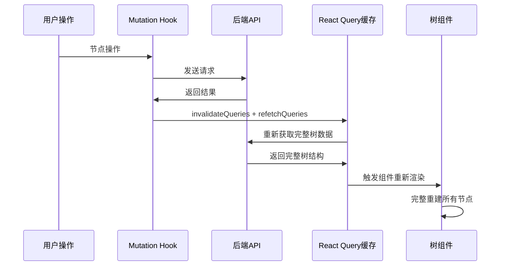

# React Tree Diff 优化方案分析

## 问题观察

当前实现中，每次节点操作（添加、编辑、删除）都会触发完整的树重新渲染，相当于"第一次打开网站"的体验。虽然对于现代计算机和少量节点而言性能影响微乎其微，但从架构优雅性角度值得思考更精细的更新策略。

## 当前数据流分析



## React Diff 优化思路

### 核心理念

> "Bad programmers worry about the code. Good programmers worry about data structures." - Linus Torvalds

关键在于重新设计数据结构，让React的diff算法能够精确识别变化，而不是暴力重建。

### 方案一：乐观更新 (Optimistic Updates)

```typescript
// 伪代码示例
const useOptimisticNodeMutation = () => {
  const queryClient = useQueryClient();

  return useMutation({
    mutationFn: nodeOperation,
    onMutate: async (variables) => {
      // 1. 取消正在进行的查询
      await queryClient.cancelQueries(["rr-tree"]);

      // 2. 获取当前数据快照
      const previousTree = queryClient.getQueryData(["rr-tree"]);

      // 3. 乐观更新：立即修改本地缓存
      queryClient.setQueryData(["rr-tree"], (old) => {
        return applyOptimisticUpdate(old, variables);
      });

      return { previousTree };
    },
    onError: (err, variables, context) => {
      // 4. 出错时回滚
      queryClient.setQueryData(["rr-tree"], context.previousTree);
    },
    onSettled: () => {
      // 5. 最终同步服务端数据
      queryClient.invalidateQueries(["rr-tree"]);
    },
  });
};
```

**优势：**

- 用户操作立即生效，无等待
- React diff算法只处理实际变化的节点
- 错误时可以优雅回滚

**挑战：**

- 需要实现复杂的本地状态更新逻辑
- 错误处理复杂度增加

### 方案二：增量数据获取

```typescript
// 后端API设计
interface NodeOperationResponse {
  operation: "create" | "update" | "delete";
  affectedNodes: TreeNode[];
  parentPath: string[];
  timestamp: number;
}

// 前端处理
const useIncrementalUpdate = () => {
  return useMutation({
    onSuccess: (response: NodeOperationResponse) => {
      queryClient.setQueryData(["rr-tree"], (oldTree) => {
        return applyIncrementalUpdate(oldTree, response);
      });
    },
  });
};
```

**优势：**

- 只传输变化的数据，网络效率高
- React diff算法精确处理变化
- 服务端逻辑相对简单

**挑战：**

- 需要重新设计API接口
- 复杂的树结构更新逻辑

### 方案三：虚拟化 + 智能Key策略

```typescript
// 稳定的节点Key生成
const generateStableKey = (node: TreeNode, path: number[]) => {
  return `${node.id}-${path.join("-")}-${node.version || 0}`;
};

// 组件优化
const TreeNode = React.memo(
  ({ node, path }) => {
    // 只有当节点数据真正变化时才重新渲染
  },
  (prevProps, nextProps) => {
    return (
      prevProps.node.id === nextProps.node.id &&
      prevProps.node.version === nextProps.node.version &&
      JSON.stringify(prevProps.path) === JSON.stringify(nextProps.path)
    );
  },
);
```

**优势：**

- 最小化代码改动
- 充分利用React内置优化
- 向后兼容性好

**挑战：**

- 需要在数据结构中添加版本信息
- 深度比较可能有性能开销

## 技术实现细节

### 数据结构优化

```typescript
// 当前结构
interface TreeNode {
  id: string;
  title: string;
  children: TreeNode[];
}

// 优化后结构
interface OptimizedTreeNode {
  id: string;
  title: string;
  children: TreeNode[];
  version: number; // 用于diff比较
  lastModified: number; // 时间戳
  parentId?: string; // 父节点引用
  depth: number; // 层级深度
}
```

### React Flow 集成考虑

```typescript
// React Flow节点更新策略
const useFlowNodes = (treeData: TreeNode[]) => {
  return useMemo(() => {
    return treeData.map((node) => ({
      id: node.id,
      type: "custom",
      position: calculatePosition(node),
      data: { ...node },
      // 关键：稳定的key确保React diff正确工作
      key: `${node.id}-${node.version}`,
    }));
  }, [treeData]);
};
```

## 性能对比分析

| 方案     | 网络请求 | 渲染性能   | 用户体验 | 实现复杂度 |
| -------- | -------- | ---------- | -------- | ---------- |
| 当前方案 | 完整数据 | 全量重渲染 | 有延迟   | 简单       |
| 乐观更新 | 最少     | 最优       | 最佳     | 高         |
| 增量获取 | 最少     | 优         | 好       | 中等       |
| 智能Key  | 完整数据 | 优         | 好       | 低         |

## Linus式判断

### 三个关键问题

1. **"这是个真问题还是臆想出来的？"**
   - 对于当前节点规模：臆想的
   - 对于未来扩展性：真问题

2. **"有更简单的方法吗？"**
   - 智能Key策略是最简单的改进
   - 乐观更新是最彻底但最复杂的方案

3. **"会破坏什么吗？"**
   - 智能Key策略：零破坏性
   - 其他方案：需要API变更

### 推荐方案

**阶段一：智能Key + React.memo**

- 最小改动，立即生效
- 充分利用React内置优化
- 零破坏性

**阶段二：考虑乐观更新**

- 当节点数量增长到影响用户体验时
- 有充足时间进行架构重构时

## 结论

> "Premature optimization is the root of all evil." - Donald Knuth

当前的"暴力重渲染"虽然看起来不够优雅，但对于现有规模完全够用。真正的优化应该在需要时进行，而不是为了"理论上的完美"。

不过，从架构演进角度，智能Key策略是一个低成本、高收益的改进，值得考虑实施。

---

_"好的架构不是一开始就完美的，而是能够优雅演进的。"_
