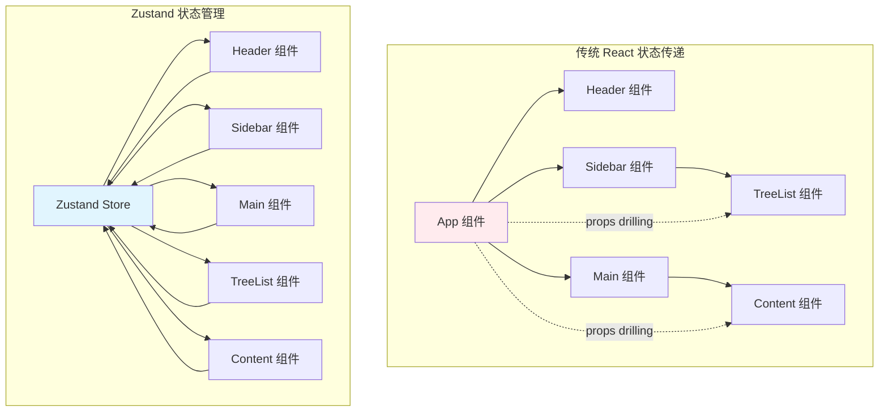
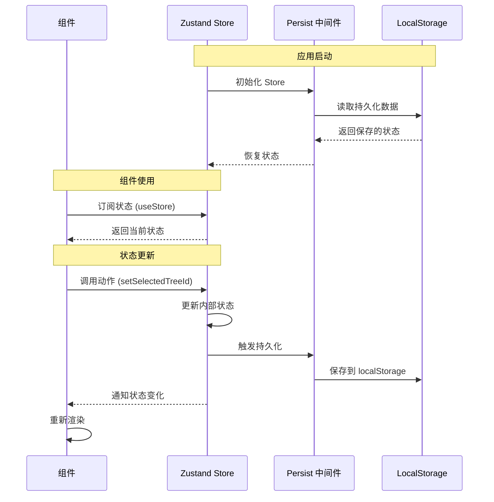
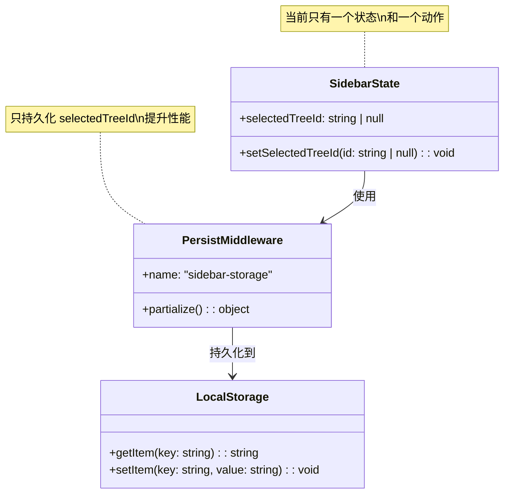
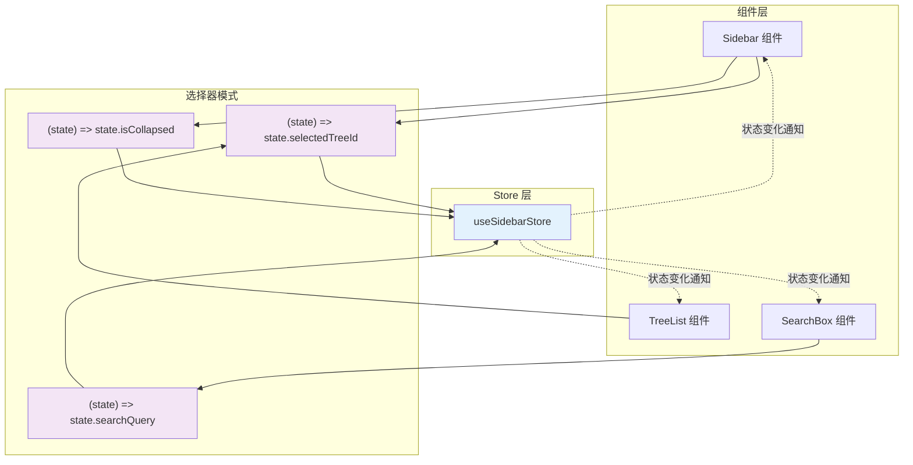
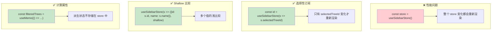
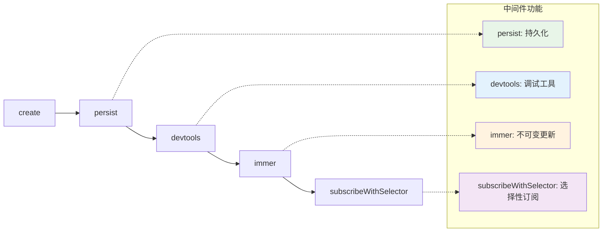

# Zustand 架构图解

## 1. 状态管理概念图

## 2. Zustand Store 生命周期

## 3. 你的 sidebar-store 结构

## 4. 扩展后的复杂 Store 结构

```mermaid
graph LR
    subgraph "Sidebar Store (扩展版)"
        subgraph "Selection Slice"
            A[selectedTreeId]
            B[setSelectedTreeId]
        end

        subgraph "UI Slice"
            C[isCollapsed]
            D[toggleCollapse]
        end

        subgraph "Search Slice"
            E[searchQuery]
            F[setSearchQuery]
            G[clearSearch]
        end

        subgraph "Favorites Slice"
            H[favoriteTreeIds]
            I[addToFavorites]
            J[removeFromFavorites]
        end
    end

    subgraph "持久化策略"
        K[localStorage]
        L[sessionStorage]
        M[不持久化]
    end

    A --> K
    C --> K
    H --> K
    E --> M

    style A fill:#c8e6c9
    style C fill:#c8e6c9
    style H fill:#c8e6c9
    style E fill:#ffcdd2
```

## 5. 组件与 Store 的交互模式

## 6. 性能优化策略

## 7. 中间件组合模式

这些图表展示了：

1. **概念对比**：传统 props drilling vs Zustand 全局状态
2. **生命周期**：从初始化到状态更新的完整流程
3. **当前结构**：你的 sidebar-store 的简单结构
4. **扩展方案**：如何组织复杂的状态
5. **交互模式**：组件如何高效地使用 store
6. **性能优化**：避免不必要的重新渲染
7. **中间件组合**：如何叠加多个功能

通过这些可视化图表，你可以更直观地理解 Zustand 的工作原理和最佳实践。
