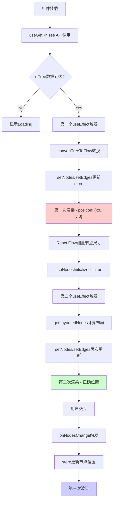

```mermaid
flowchart TD
    A[组件挂载] --> B[useGetRrTree API调用]
    B --> C{rrTree数据到达?}
    C -->|No| D[显示Loading]
    C -->|Yes| E[第一个useEffect触发]

    E --> F[convertTreeToFlow转换]
    F --> G["setNodes/setEdges更新store"]
    G --> H["第一次渲染 - position: {x:0, y:0}"]

    H --> I[React Flow测量节点尺寸]
    I --> J[useNodesInitialized = true]
    J --> K[第二个useEffect触发]

    K --> L[getLayoutedNodes计算布局]
    L --> M[setNodes/setEdges再次更新]
    M --> N[第二次渲染 - 正确位置]

    N --> O[用户交互]
    O --> P[onNodesChange触发]
    P --> Q[store更新节点位置]
    Q --> R[第三次渲染]

    style H fill:#ffcccc
    style N fill:#ccffcc
    style R fill:#ccccff
```
