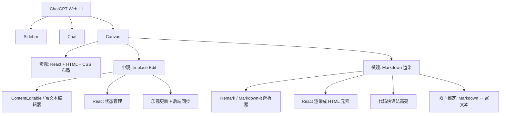

# 右侧节点详情面板设计方案

## 需求分析

当用户点击流程图节点时，需要从右向左滑出一个区域（类似Notion的右侧page或ChatGPT Canvas），同时关闭左侧sidebar。这个区域用于渲染节点的markdown文档内容。

## 核心设计思路

基于"好品味"原则，我们要消除特殊情况，让右侧面板的行为与左侧sidebar保持一致的交互模式。

### 数据结构设计

```typescript
// 扩展现有的FlowState，添加右侧面板状态
export type RightPanelState = {
  isOpen: boolean;
  selectedNode: FlowNode | null;
  setIsOpen: (open: boolean) => void;
  setSelectedNode: (node: FlowNode | null) => void;
  openWithNode: (node: FlowNode) => void;
  close: () => void;
};
```

### 组件架构

```
SidebarProvider (现有)
├── AppSidebar (左侧，现有)
├── SidebarInset (主内容区，现有)
│   └── FlowContent (现有)
└── RightPanel (新增)
    ├── RightPanelHeader
    ├── RightPanelContent
    └── RightPanelFooter
```

## 实现方案

### 1. 状态管理 (lib/stores/right-panel.ts)

```typescript
import { create } from "zustand";
import { FlowNode } from "../types/models";

export type RightPanelState = {
  isOpen: boolean;
  selectedNode: FlowNode | null;
  setIsOpen: (open: boolean) => void;
  setSelectedNode: (node: FlowNode | null) => void;
  openWithNode: (node: FlowNode) => void;
  close: () => void;
};

const useRightPanelStore = create<RightPanelState>((set) => ({
  isOpen: false,
  selectedNode: null,
  setIsOpen: (open) => set({ isOpen: open }),
  setSelectedNode: (node) => set({ selectedNode: node }),
  openWithNode: (node) => set({ isOpen: true, selectedNode: node }),
  close: () => set({ isOpen: false, selectedNode: null }),
}));

export default useRightPanelStore;
```

### 2. 右侧面板组件 (components/right-panel/right-panel.tsx)

```typescript
"use client";

import { X } from "lucide-react";
import { Button } from "@/components/ui/button";
import { cn } from "@/lib/utils";
import useRightPanelStore from "@/lib/stores/right-panel";
import { useSidebar } from "@/components/ui/sidebar";
import { useEffect } from "react";

const RIGHT_PANEL_WIDTH = "400px";

export function RightPanel() {
  const { isOpen, selectedNode, close } = useRightPanelStore();
  const { setOpen: setSidebarOpen } = useSidebar();

  // 当右侧面板打开时，关闭左侧sidebar
  useEffect(() => {
    if (isOpen) {
      setSidebarOpen(false);
    }
  }, [isOpen, setSidebarOpen]);

  if (!selectedNode) return null;

  return (
    <>
      {/* 遮罩层 */}
      <div
        className={cn(
          "fixed inset-0 z-40 bg-black/20 transition-opacity duration-200",
          isOpen ? "opacity-100" : "opacity-0 pointer-events-none"
        )}
        onClick={close}
      />

      {/* 右侧面板 */}
      <div
        className={cn(
          "fixed top-0 right-0 z-50 h-full bg-background border-l transition-transform duration-200 ease-in-out",
          "flex flex-col shadow-lg",
          isOpen ? "translate-x-0" : "translate-x-full"
        )}
        style={{ width: RIGHT_PANEL_WIDTH }}
      >
        {/* 头部 */}
        <div className="flex items-center justify-between p-4 border-b">
          <h2 className="text-lg font-semibold truncate">
            {selectedNode.data.rrNode.title}
          </h2>
          <Button
            variant="ghost"
            size="icon"
            onClick={close}
            className="h-8 w-8"
          >
            <X className="h-4 w-4" />
          </Button>
        </div>

        {/* 内容区域 */}
        <div className="flex-1 overflow-auto p-4">
          <div className="space-y-4">
            <div>
              <h3 className="text-sm font-medium text-muted-foreground mb-2">
                标题
              </h3>
              <p className="text-sm">{selectedNode.data.rrNode.title}</p>
            </div>

            {selectedNode.data.rrNode.description && (
              <div>
                <h3 className="text-sm font-medium text-muted-foreground mb-2">
                  描述
                </h3>
                <div className="text-sm whitespace-pre-wrap">
                  {selectedNode.data.rrNode.description}
                </div>
              </div>
            )}
          </div>
        </div>

        {/* 底部 */}
        <div className="p-4 border-t">
          <p className="text-xs text-muted-foreground">
            节点ID: {selectedNode.id}
          </p>
        </div>
      </div>
    </>
  );
}
```

### 3. 修改FlowContent组件的onNodeClick

```typescript
// 在 flow-content.tsx 中
import useRightPanelStore from "@/lib/stores/right-panel";

const onNodeClick = useCallback((event: React.MouseEvent, node: FlowNode) => {
  console.log("Node clicked:", node.id);

  // 打开右侧面板并传入节点数据
  const { openWithNode } = useRightPanelStore.getState();
  openWithNode(node);
}, []);
```

### 4. 修改根布局 (app/layout.tsx)

```typescript
import { RightPanel } from "@/components/right-panel/right-panel";

export default function RootLayout({
  children,
}: Readonly<{
  children: React.ReactNode;
}>) {
  return (
    <html lang="en" suppressHydrationWarning>
      <body className={`${geistSans.variable} ${geistMono.variable}`}>
        <ThemeProvider
          attribute="class"
          defaultTheme="system"
          enableSystem
          disableTransitionOnChange
        >
          <Providers>
            <SidebarProvider defaultOpen={true}>
              <AppSidebar />
              <SidebarInset>
                <div className="flex flex-1 flex-col gap-4 p-4">{children}</div>
              </SidebarInset>
              <RightPanel /> {/* 新增 */}
            </SidebarProvider>
          </Providers>
        </ThemeProvider>
      </body>
    </html>
  );
}
```

## 交互逻辑

1. **打开右侧面板**：点击节点 → 自动关闭左侧sidebar → 右侧面板从右向左滑入
2. **关闭右侧面板**：点击关闭按钮或遮罩层 → 右侧面板向右滑出
3. **键盘支持**：ESC键关闭右侧面板
4. **响应式**：移动端可考虑全屏显示

## 样式设计

- **宽度**：固定400px，与常见的侧边面板保持一致
- **动画**：200ms的滑动动画，与左侧sidebar保持一致
- **层级**：z-index 50，确保在其他元素之上
- **遮罩**：半透明黑色遮罩，点击关闭

## 扩展性考虑

1. **Markdown渲染**：后续可集成react-markdown组件
2. **编辑功能**：可在面板中添加编辑按钮
3. **历史记录**：可记录最近查看的节点
4. **快捷键**：可添加快捷键支持

## 实现优先级

1. **P0**：基础的右侧面板显示和关闭
2. **P1**：与左侧sidebar的交互逻辑
3. **P2**：键盘支持和响应式优化
4. **P3**：Markdown渲染和编辑功能

这个设计遵循了"好品味"原则：

- 消除了特殊情况（复用sidebar的交互模式）
- 数据结构简洁明了
- 组件职责单一
- 易于扩展和维护
